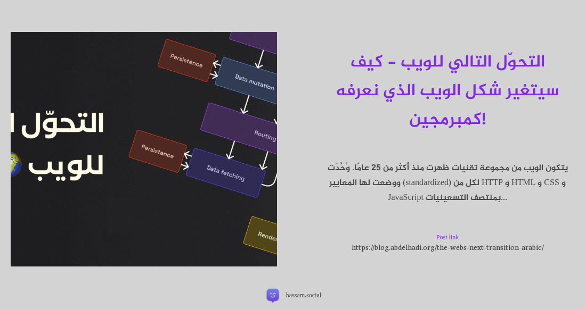

# Pleroma_Bot

انشاء صور من تغذية RSS ونشرها على منصة Pleroma


- انشاء االصور بإستخدام puppeteer 
- ترجمة تلقائية للغة العربية بإستعمال puppeteer (google translate)
- نشر تلقائي على حسابك في منصات Pleroma او Mastodon

# المتطلبات

- nodejs 
- متصفح chromium او chrom 
- رمز accessToken لمنصة Pleroma او Mastodon
- تحرير ملف config.json 


```json
{
    "server": "https://bassam.social",
    "executablePath": "/usr/bin/google-chrome-stable",
    "accessToken": "3bzFMesodjw09cmyrtsdfiokGiuytyu",
    "translate": true,
    "rss": [
        "http://www.omgubuntu.co.uk/feed",
        "http://9to5linux.com/feed",
        "http://discourse.aosus.org/latest.rss",
        "http://itsfoss.com/rss",
        "http://www.webupd8.org/rss.xml",
        "http://frontpagelinux.com/feed",
        "http://www.tecmint.com/feed",
        "http://ubuntu.com/blog/feed",
        "http://spreadprivacy.com/rss",
        "http://www.redhat.com/sysadmin/rss.xml",
        "http://www.kali.org/rss.xml",
        "http://matrix.org/blog/feed",
        "http://www.pine64.org/feed",
        "http://rockylinux.org/rss.xml",
        "http://forums.whonix.org/tags/important-news.rss",
        "http://blog.barmej.com/feed",
        "http://www.tutomena.com/rss.xml",
        "https://blog.abdelhadi.org/rss",
        "http://badwi.com/rss",
        "http://informatic-ar.com/feed",
        "http://colorslab.com/blog/feed",
        "http://feeds.feedburner.com/itwadi",
        "https://librar.net/feed",
        "https://abotyim.github.io/ar/index.xml",
        "https://aitnews.com/feed",
        "https://www.linuxuprising.com/feeds/posts/default",
        "https://9to5google.com/feed",
        "https://www.networkworld.com/index.rss",
        "https://www.kitploit.com/feeds/posts/default?alt=rss",
        "https://gbhackers.com/feed",
        "https://fariszr.com/index.xml",
        "https://git.x7md.net/rss.xml"
    ]
}
```
- - server = مجال السيرفر
- - executablePath = مسار متصفح chromium او chrom 

```bash
which chromium
```

```
linux:

/usr/bin/google-chrome-stable

or 

/usr/bin/chromium

or 

/snap/bin/chromium

windows:


C:\\Program Files\\Google\\Chrome\\Application\\chrome.exe


MacOS:

/Applications/Google Chrome.app/Contents/MacOS/Google Chrome
```

- - accessToken = رمز الوصول لحسابك لمنصة Pleroma او Mastodon
- - translate = تفعيل ترجمة الموجز او إلغائها true = تفعيل | false = تعطيل
- - rss = روابط تغذية rss


# مثال على الصور

<p align="center">
  
</p>


# تثبيت 

```bash
git clone https://github.com/rn0x/Pleroma_Bot
cd Pleroma_Bot
npm i
npm start
```


# تشغيل التطبيق عبر pm2

لتشغيل البوت مع بدء تشغيل النظام 

```bash
sudo npm install pm2 -g
pm2 startup
cd Pleroma_Bot
pm2 start index.js --name rss
pm2 save

# log 

pm2 log rss

# إعادة تشغيل البوت كل ساعة 

pm2 restart rss --cron-restart="0 * * * *"
pm2 save

```